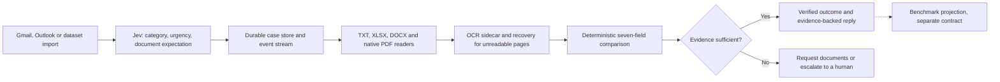
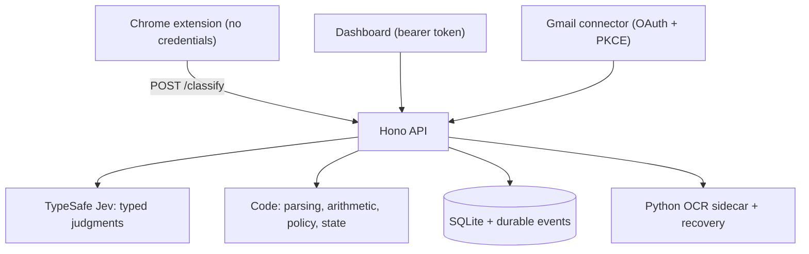

<!-- markdownlint-disable MD013 -->

# CargoLens

<p align="center">
  <strong>Every shipping email understood. Every document decision evidence-backed.</strong>
</p>

<p align="center">
  <a href="https://github.com/Pyjalal/Monash-Hack/issues"><strong>Issue board</strong></a>
  ·
  <a href="apps/api/src/documents/README.md"><strong>Document readers</strong></a>
  ·
  <a href="tools/eval/README.md"><strong>Evaluation harness</strong></a>
  ·
  <a href="docs/connector-verification.md"><strong>Connector verification</strong></a>
</p>

CargoLens is a shipping-document intelligence workspace for operations teams
that live in their inbox. It classifies every inbound email — comparison
request, SI request, invoice query, general, spam — scores its urgency, reads
the attached Shipping Instruction and draft Bill of Lading, compares the seven
fields that decide a shipment, and escalates to a human the moment evidence
runs out. Typed judgments come from [TypeSafe Jev](https://docs.typesafe.ai);
arithmetic, aliases, completion rules and every state transition stay in
deterministic, unit-tested code.

The product is designed so that no credential ever reaches the browser: the
Chrome extension calls a local API that owns the TypeSafe key, the dashboard is
gated by a bearer token, and Gmail access flows through an encrypted OAuth
connection. Jev proposes; code verifies; only source evidence can clear a
document. A request for a future draft stays **awaiting documents** even when a
benchmark convention labels it `OK`.

## The flagship journey: from inbox to verified documents



Classification is the fast path: one bounded Jev request per email, badges
streamed to the extension and dashboard over server-sent events. Verification
is the careful path: documents are read independently, candidates carry exact
source locations, and a comparison claim is saved only after source-proof
validation. Both paths share one case store, so the extension badge, the
dashboard and the benchmark export always describe the same operational state.

## What works now — and what still needs a partner

Implemented today:

- Typed Jev category, urgency and document-expectation questions; batches of
  eight, bounded concurrency and retries, content caching, durable events.
- TXT/CSV/TSV, XLSX, DOCX and native PDF
  [readers and label/value candidates](apps/api/src/documents/README.md) with
  byte hashes and exact source locations. Candidate pairings are structural
  hypotheses for the field selector. Scanned pages are explicitly marked for
  OCR.
- An optional Python/Tesseract [OCR sidecar](tools/ocr-sidecar) and Node
  recovery reader that preserve native evidence separately, validate source
  hashes, and bound process concurrency, output size and timeouts. See the
  [recovery reader contract](apps/api/src/documents/README.md#optional-ocr-recovery).
- Gmail OAuth client with PKCE, thread/reference lookup, durable outbound
  queue, four reply templates, stale-source checks and resume fixtures.
- Source-proof validation before saving a comparison claim or queueing a
  confirmation: bytes, excerpts and source pairs must agree, and the trusted
  role classifier and field comparator must establish their meaning.
- Version-bound operational drafts shared with the Gmail queue, and optional
  OpenRouter recovery of unresolved fields from selected server-read regions.
  Recovery candidates remain proposals until the field comparator validates them.
- A one-command organizer evaluation runner with frozen grouped manifests,
  export provenance, explicit failed rows, and source-backed dispute overlays.

Still assigned integration work:

- The document-role/field comparator, OCR-aware field integration and vision
  escalation, automatic recovery orchestration, dashboard
  and workflow builder.
- Low-confidence or conflicting classifications emit recovery signals; a
  recovery model is not yet connected end to end.

A request for a future draft remains **awaiting documents**, never verified
solely because the benchmark labels it `OK`.

## Quick start

### Prerequisites

- Node.js 20.19 or newer and npm.
- Python 3 with Tesseract for the optional OCR sidecar.
- A TypeSafe API key; Google Cloud OAuth credentials only for connector work.

### Environment variables

Copy `.env.example` to `.env`. The running API requires `TYPESAFE_API_KEY` and
`DASHBOARD_TOKEN`; generate a long random token and keep it server-side.

| Variable | Purpose |
|---|---|
| `TYPESAFE_API_KEY` | Jev inference. Never placed in the extension. |
| `DASHBOARD_TOKEN` | Bearer token for every route except `/health` and `/classify`. |
| `HOST` / `PORT` | API bind address, default `127.0.0.1:3001`. |
| `DATABASE_PATH` | SQLite location, default `runtime/cargolens.sqlite`. |
| `DATASET_ROOT` | Dataset root, default `training_data/sdoc-hackathon-docker/extracted/data_v2`. |
| `TYPESAFE_MODEL` / `JEV_PROMPT_VARIANT` | Pinned model and question variant; both feed the classifier revision. |
| `JEV_CONCURRENCY` / `JEV_BATCH_SIZE` / `JEV_REQUESTS_PER_MINUTE` | Throughput controls for classification. |
| `GMAIL_*` | OAuth registration, polling, sync query and automation switches; see [Gmail configuration](#gmail-configuration). |
| `OPENROUTER_API_KEY` / `OPENROUTER_TEXT_MODEL` | Optional server-side text recovery; see [backend integration](docs/backend-integration.md). |
| `RECOVERY_MAX_CASE_ATTEMPTS` / `RECOVERY_MAX_CASE_TOKENS` / `RECOVERY_MAX_CASE_USD` | Durable per-case recovery reservation ceilings, including failed attempts. |
| `AI_GATEWAY_API_KEY` | Reserved for gateway integration. |

### Run the API

```sh
npm ci
cp .env.example .env   # then set TYPESAFE_API_KEY and DASHBOARD_TOKEN
npm run dev
```

The API binds to `http://127.0.0.1:3001`. `GET /health` and `POST /classify`
are public local endpoints. Health includes a `classifierRevision` hash so
preview clients can invalidate cached results when the model, questions or
packing configuration changes. Every other route requires
`Authorization: Bearer <DASHBOARD_TOKEN>`. The extension never receives API
keys or this token. Local environment files, SQLite databases and evaluation
outputs are ignored by Git.

`POST /import` imports the configured dataset and returns a job immediately.
Follow `GET /events` for results or use `GET /emails`; `GET /cases/:id`
includes the full operational state. SSE reconnects accept `Last-Event-ID`.
`GET /usage` is the authoritative request-level token total; packed
classifications have `usage: null` and reference their shared `usageRequestId`.
Response-level request usage can overlap across concurrent preview calls, so do
not sum it for billing.

`POST /classify` accepts up to 20 unique-ID preview rows:

```json
{"emails":[{"id":"visible-row-1","subject":"Please check the draft BL","from":"sender@example.com","snippet":"Compare the attached draft with our SI."}]}
```

Preview results use only the visible subject/snippet and cannot establish
document verification. Public previews do not overwrite imported cases.

### Load the extension

With the local API running:

```sh
npm run build:extension
```

In Chrome's extension manager, enable Developer mode, choose **Load unpacked**,
and select `apps/extension/dist`. Open the CargoLens popup to check the local
API and enable previews. The supported inbox hosts are Gmail, Outlook Live and
Outlook Office. `Ctrl+Shift+L` toggles previews. Reload existing mailbox tabs
after loading or updating the extension.

Badges classify visible subject/snippet text; the urgent tray provides
shortcuts to native rows. No mailbox OAuth token is needed for these previews.
Full-thread retrieval and outbound automation use the Gmail connector below.
Gmail and Outlook Live were checked in signed-in Chrome on 2026-09-20; see
[connector and adapter verification](docs/connector-verification.md) for tested
layouts and remaining limitations.

Successful previews are cached for five minutes in browser session storage, up
to 200 entries. Cache keys include the mailbox context, local API endpoint,
classifier revision and content fingerprint, and are stored as hashes. The
cache stores classification metadata, not email subjects, senders or snippets.
Changed content or classifier configuration triggers a new classification;
**Retry** bypasses the cached result. API failures remain visible and are not
cached as successful classifications.

## Gmail configuration

Add `GMAIL_CLIENT_ID`, `GMAIL_CLIENT_SECRET`, `GMAIL_MAILBOX_ADDRESS` and
`GMAIL_OAUTH_REDIRECT_URI` to `.env`. Register the exact callback URI in Google
Cloud; the local default is `http://127.0.0.1:3001/gmail/oauth/callback`. The
connector requests only `gmail.readonly` and `gmail.send`.

With the server running, call authenticated `POST /gmail/oauth/start`, then
open the returned URL and consent with the configured mailbox. The server
checks one-use state, PKCE, required scopes and mailbox identity before saving
the refresh token encrypted in SQLite. Alternatively, an existing
`GMAIL_REFRESH_TOKEN` seeds the encrypted store once. A disconnected or revoked
connection is not silently re-enabled by that environment variable: reconnect
through OAuth. Encryption is bound to the client secret and mailbox; rotating
either requires reconnection. Keep both the environment file and runtime
database private.

`GMAIL_POLL_ENABLED=true` enables bounded polling independently of sending.
`GMAIL_SYNC_QUERY` defaults to inbox excluding spam and trash. The mailbox/query
cursor survives restarts; failed pages are retried, invalid cursors restart the
scan, and full rounds rescan for new replies. This is polling, not Gmail push
or history synchronization.

`GMAIL_AUTOMATION_ENABLED=false` permits ingestion and queued-reply inspection
without sending. Setting it to `true` enables eligible dispatch during sync and
through the dispatch route. Set `GMAIL_DOCUMENTATION_CONTACT` only to the
responsible documentation contact: requests for a draft from us are routed
there, or ask for clarification when responsibility is unknown. No BL is
fabricated.

Live read, full-thread ingestion, attachment bytes and classification were
verified on 2026-09-20 with outbound sending disabled. Delivery remains covered
by fixtures; no live email was sent during this verification.

## API routes

| Method | Route | Auth | Purpose |
|---|---|---|---|
| `GET` | `/health` | public | Service status and `classifierRevision`. |
| `POST` | `/classify` | public, budgeted | Up to 20 preview rows for the extension. |
| `GET` | `/usage` | bearer | Authoritative request-level token totals. |
| `POST` | `/import` | bearer | Import the configured dataset; returns a job. |
| `GET` | `/emails` | bearer | Imported inbox with classification state. |
| `GET` | `/cases/:id` | bearer | Full operational state for one case. |
| `POST` | `/cases/:id/retry` | bearer | Re-run a failed or signalled case. |
| `POST` | `/cases/:id/decision` | bearer | Record a human decision. |
| `POST` | `/cases/:id/draft` | bearer | Persist an evidence-bound reply draft; requires source and decision versions. |
| `POST` | `/cases/:id/recover` | bearer | Propose unresolved fields from selected attachment source regions. |
| `GET` | `/events` | bearer | Server-sent events; honours `Last-Event-ID`. |
| `POST` | `/gmail/oauth/start` | bearer | Begin the OAuth consent flow. |
| `GET` | `/gmail/oauth/callback` | public | One-use OAuth callback (state + PKCE). |
| `GET` | `/gmail/connection-result` | public | Generic connection-result page. |
| `GET` | `/gmail/status` | bearer | Connector configuration and polling state. |
| `POST` | `/gmail/sync` | bearer | Manual ingestion, e.g. `{"maxMessages":1}`. |
| `GET` | `/gmail/outbox` | bearer | Inspect queued replies. |
| `POST` | `/gmail/dispatch` | bearer | Dispatch eligible queued replies. |
| `POST` | `/gmail/disconnect` | bearer | Revoke and clear the stored connection. |

## Architecture and trust boundaries



Three boundaries hold the system honest:

1. **Labels never enter inference.** Ground truth, filenames and email IDs are
   evaluation-only. Jev answers what the sender requests and what the source
   establishes — never which answer a scorer would reward.
2. **The model proposes, code decides.** Jev returns typed choices and
   probabilities; parsing, arithmetic, alias handling, completion rules and
   state transitions are code-owned and unit-tested.
3. **Product state is separate from benchmark output.** A versioned export
   adapter projects operational state into the organizer schema; a benchmark
   `OK` cannot authorize sending, clear a blocker or mark documents verified.

## Commands and verification

```sh
npm test          # vitest suites across api, shared and extension
npm run typecheck # strict TypeScript across workspaces
npm run lint      # eslint
```

`npm run eval -- --prepare` freezes the official dataset, scorer, grouped splits
and configuration without model calls. `npm run eval` runs the API classification
pipeline, exports supported decisions and invokes the unchanged organizer scorer.
Incomplete comparison states are explicit export failures, so a partial run is
never presented as a valid headline score. Live evaluation makes paid model calls.
See the [evaluation guide](tools/eval/README.md) for offline checks, dispute
adjudication, and final-run protection. `npm run eval:classify` retains the separate
category tuning harness.

## Measured results

On 19 September 2026, the cold HTTP API import classified and saved 520 emails
in 7.80 seconds using 64 Jev requests (505 distinct content states). Category
agreement was 513/520 (98.65%); macro-F1 was 0.9878. All seven misses carried
an uncertainty/recovery signal in this run. This does not establish perfect
recovery. Estimated input cost was $0.0351 at the supplied $0.042/M rate,
excluding any output charge. A persisted re-import took 0.56 seconds with no
new provider calls.

These are individual measured runs, not latency guarantees, and exclude
attachment extraction and comparison.

## Training data

The downloaded `sdoc-hackathon-docker.zip` archive is stored at
`training_data/sdoc-hackathon-docker/`. The extracted bundle contains:

- `data_v2/`: 520 synthetic shipping-document inbox records, attachments,
  sample submissions, and ground truth.
- `server/`: FastAPI serving, loading, bundle-building, and scoring utilities.
- `docker-compose.yml`: optional local scoring server configuration.

The dataset includes `data_v2/ground_truth.json`, so this repository must
remain private until the answer key is intentionally released. See
[the dataset README](training_data/sdoc-hackathon-docker/extracted/data_v2/README.md)
for the schema, categories, edge cases, and regeneration instructions.

## Project map

```
apps/api/           Hono service: pipeline, document readers, OCR recovery, Gmail connector
apps/dashboard/     React dashboard workspace (reserved)
apps/extension/     MV3 Chrome extension for Gmail and Outlook web
packages/shared/    Zod schemas and Jev question contracts
tools/eval/         Classification evaluation harness
tools/ocr-sidecar/  Python/Tesseract OCR CLI
docs/               Connector and adapter verification notes
training_data/      SDOC dataset, attachments and organizer scorer
```

## Known limitations and next proof points

- The comparator must still populate source-validated seven-field decisions
  before the evaluation runner can produce a complete submission. Dashboard and
  workflow builder are pending integration work.
- Live Gmail read, threading and attachment ingestion were verified on
  2026-09-20 with sending disabled; delivery is covered by fixtures only.
- Text recovery is available through the authenticated API; automatic recovery
  orchestration and semantic acceptance by the comparator remain pending.
- Measured results cover classification only; extraction, comparison and OCR
  paths are validated by unit tests and fixtures, not yet by a full scored run.
