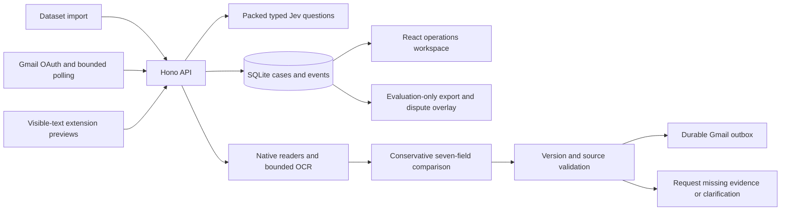

# Teammate setup and demo

Run commands from the repository root. Node 20.19+ and npm are required; Node 22 or 24 also work. Python 3.12 is the verified OCR runtime. Tesseract must be installed separately from the Python wrapper and available on PATH; Windows also supports the standard `C:\Program Files\Tesseract-OCR\tesseract.exe` location.

## Install and configure

```sh
npm ci
python -m pip install -r tools/ocr-sidecar/requirements.txt
python -c "import fitz, pytesseract, PIL; print('OCR imports ready')"
tesseract --version
```

Create `.env` with `cp .env.example .env` in Git Bash, or `Copy-Item .env.example .env` in PowerShell. Set `TYPESAFE_API_KEY` and a randomly generated `DASHBOARD_TOKEN`. Do not copy another teammate's credentials. Optional recovery uses `OPENROUTER_API_KEY`; Gmail configuration is separate below. Keep environment files and runtime databases out of Git.

Start the API with `npm run dev`. In a second terminal run `npm run dev:dashboard`, then open `http://127.0.0.1:5173`. Enter `http://127.0.0.1:3001` in API address and your local workspace token in the login form. If a same-origin deployment is configured, use that API origin instead. The dashboard token is operator authentication, not a model or mailbox key.

`GET http://127.0.0.1:3001/health` should succeed. Choose **Import inbox** to process the configured `DATASET_ROOT`; this makes paid Jev calls. The dashboard shows persisted cases, comparison evidence, recoverable errors, measurements and delivery history. Numeric mismatches and missing evidence remain explicit.

## No-key UI walkthrough

```sh
npx tsx tools/dashboard/preview.ts
npm run dev:dashboard
```

Use API address `http://127.0.0.1:3003` and the public fixture token `cargolens-qa-only`. This creates a temporary 520-case synthetic workspace, clearly labelled in the UI, with no provider calls or outbound transport. It is a functional UI fixture, not a Jev benchmark. Select the first case to inspect its 3-versus-4 container mismatch; the second requests a future draft and remains awaiting documents.

## Extension

Run `npm run build:extension`. In Chrome's extension manager enable Developer mode and load `apps/extension/dist` unpacked. After subsequent builds, reload CargoLens and refresh existing Gmail or Outlook tabs. The popup's API address is `http://127.0.0.1:3001`; **Check health** verifies connectivity. Inbox badges use visible text only. Settings control reversible local hiding, pinning and smart filters; they do not modify the mailbox.

## Gmail connection

Configure `GMAIL_CLIENT_ID`, `GMAIL_CLIENT_SECRET`, `GMAIL_MAILBOX_ADDRESS` and the exact registered `GMAIL_OAUTH_REDIRECT_URI`. Keep polling and sending disabled during initial connection. Authenticated `POST /gmail/oauth/start` returns the Google consent URL. Complete consent for `gmail.readonly` and `gmail.send`, then inspect `GET /gmail/status`. An existing `GMAIL_REFRESH_TOKEN` can seed the encrypted store once; reconnect revoked connections through OAuth.

Authenticated `POST /gmail/sync` with `{"maxMessages":1}` ingests a bounded sample. Inspect sources and `GET /gmail/outbox` before enabling `GMAIL_AUTOMATION_ENABLED=true`. `GMAIL_POLL_ENABLED=true` independently enables polling. Sending is restricted to evidence-backed, version-bound operations; unresolved transport ambiguity must not be blindly retried. Polling is implemented; Gmail push-watch renewal and Microsoft Graph are roadmap work. See [connector verification](connector-verification.md) for the exact live evidence and limitations.

## Evaluation and checks

```sh
npm test
npm run typecheck
npm run lint
npm run build:dashboard
npm run build:extension
npm run eval -- --prepare --output runtime/eval/my-cycle
npm run eval -- --scope development --output runtime/eval/my-cycle
npm run eval -- --scope final --output runtime/eval/my-cycle
```

Preparation makes no inference calls. Live evaluation costs API usage and freezes source, scorer, implementation and split hashes. Final execution is single-use per frozen cycle; another directory does not make previously inspected data unseen. `--offline` exercises accounting without inference and deliberately exits nonzero. Official labels stay untouched and runtime code cannot consume corrected references. See [evaluation commands](../tools/eval/README.md) for dispute triage and archived CRLF-byte reproduction requirements.

The latest frozen report accounts for 520 cases but exports only 359, with 161 explicit failures. Category macro-F1 is 0.979; defect detection and review recall targets remain unmet. These measurements do not establish a complete verification system. Final independent document scorecards remain unfinished.

## Implemented architecture and limits



The conservative comparator requires explicit SI/BL roles, shipment identity and grounded values. It does not yet support the full variety of official document layouts. Text recovery proposes unresolved fields; it cannot silently overwrite proven values. The workflow builder, broader document understanding and final independent document evaluation remain unfinished.
