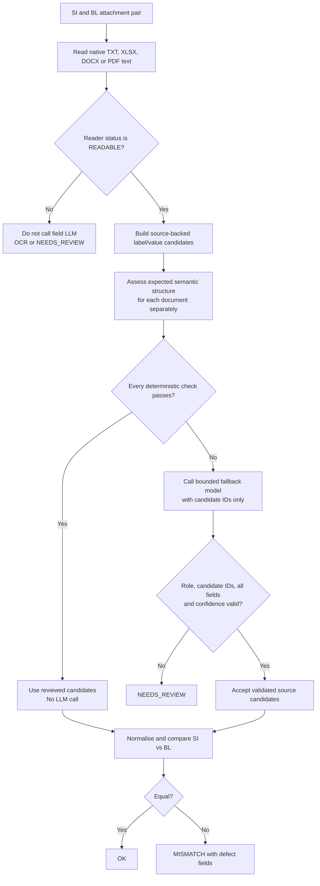

# SI/BL hybrid extraction and fallback policy

## Purpose

CargoLens compares a Shipping Instruction (SI) and draft Bill of Lading (BL)
across seven fields: `shipper`, `consignee`, `notify_party`,
`port_of_loading`, `port_of_discharge`, `container_count`, and
`gross_weight_kg`.

The system uses deterministic, source-backed extraction for reviewed document
structures, calls a bounded low-cost model only for the document that has
drifted, and rejects incomplete evidence rather than guessing.

The implementation is in
[`apps/api/src/documents/field-extraction.ts`](../apps/api/src/documents/field-extraction.ts)
and is currently called by the benchmark/export pipeline in
[`tools/eval/src/submission.ts`](../tools/eval/src/submission.ts).

It is not yet automatically invoked by the live Gmail/API workflow. A
benchmark result is not authorization to send a customer reply.

## Flow



SI and BL are assessed independently. If the SI is known-format but the BL
has drifted, only the BL is sent to the fallback model.

## 1. Native extraction and provenance

Readers produce literal label/value candidates, not untraceable strings. Every
candidate retains the document SHA-256, original label and value, and exact
line, PDF page, or spreadsheet cell spans.

For example:

```text
Port of Loading (POL): PORT KLANG (MYPKG)
```

becomes an evidence item equivalent to:

```json
{
  "label": "Port of Loading (POL)",
  "value": "PORT KLANG (MYPKG)",
  "source": { "sha256": "…", "labelSpans": ["line 5"], "valueSpans": ["line 5"] }
}
```

The candidate reader supports colon/tab-delimited values, neighbouring XLSX
cells/rows, adjacent DOCX paragraphs, and PDF-style whitespace-aligned labels.
For aligned PDF forms it retains following address lines until the next label,
so party evidence is not silently shortened.

## 2. How expected structure is defined

`assessExpectedFormat` uses a semantic contract, not one rigid layout.

### Role marker

The first three non-empty lines must identify the expected role.

| Expected role | Accepted examples |
|---|---|
| SI | `SHIPPING INSTRUCTION`, `SHIPPING INSTRUCTIONS`, `BL INSTRUCTION` |
| BL | `BILL OF LADING`, `BILL OF LADING (DRAFT)`, `DRAFT B/L` |

Missing, conflicting, or opposite markers are drift signals. The marker never
silently changes the expected SI/BL role of the paired attachment.

### Label aliases

Labels are normalized through Unicode NFKC conversion, lowercasing,
punctuation/spacing compaction, separator normalization, and removal of Chinese
characters from mixed bilingual labels. The normalized label is then checked
against a reviewed alias policy.

| Field | Accepted label examples |
|---|---|
| `shipper` | `Shipper`, `Shipper/Exporter`, `Shipper (Principal or Seller)` |
| `consignee` | `Consignee`, `Consignee (Non-Negotiable)`, `To the Order of` |
| `notify_party` | `Notify`, `Notify Party`, `Notify Party/Intermediate Consignee` |
| `port_of_loading` | `Port of Loading`, `Port of Loading (POL)`, `POL`, `Load Port` |
| `port_of_discharge` | `Port of Discharge`, `Discharge Port`, `Port of Discharge (POD)`, `POD` |
| `container_count` | `No. of Containers`, `Container Count`, `Total Containers` |
| `gross_weight_kg` | `Gross Weight`, `Gross Weight (KG)`, `Gross Wt (kgs)`, `TOTAL Gross Weight (KG)` |

Aliases are a versioned policy. An LLM result never automatically adds a new
alias; an engineer must review representative documents and add tests first.

### Deterministic validation matrix

All checks below must pass to avoid a model call.

| Validation | Required condition | Drift or block reason |
|---|---|---|
| Reader | Status is `READABLE` | `unreadable` |
| Role | Header matches expected SI or BL | missing, conflicting, or unexpected role marker |
| Coverage | Every field has a reviewed candidate | `missing_expected_label:<field>` |
| Uniqueness | Exactly one candidate maps to each field | `ambiguous_expected_label:<field>` |
| Text plausibility | Party/port value has meaningful letters or numbers | `implausible_value:<field>` |
| Container count | Value contains a number | `implausible_value:container_count` |
| Gross weight | Value contains a number; the label may provide KG | `implausible_value:gross_weight_kg` |

Field order is not validated. Reordering known fields stays deterministic, but
a new label such as `Exporter legal entity` routes the document to fallback.

## 3. When the LLM is called

The fallback LLM is called only for a readable document that fails at least one
expected-structure validation.

| Case | Example | Why deterministic extraction stops |
|---|---|---|
| Unfamiliar label | `Exporter legal entity` | No approved mapping to `shipper` |
| Missing field | No notify-party candidate | Field cannot be proved |
| Duplicate field | Two Notify Party values | Selecting one would be arbitrary |
| Changed layout | Label/value association is unclear | Candidate meaning needs semantic recovery |
| Wrong document type | Invoice labelled as SI | Pair is unsafe |
| Invalid numeric text | `Gross Weight: pending` | Comparison is meaningless |

The LLM is not called for `OCR_REQUIRED`, garbled, unsupported, oversized, or
otherwise unreadable documents. Those go to OCR/recovery or human review;
incomplete native text must not create false confidence.

## 4. Fallback request and validation

The fallback receives one document at a time, bounded to:

- expected document role (`si` or `bl`);
- at most 16,000 characters of source text; and
- at most 80 source-backed candidates.

For each field, it must select a candidate ID or `missing`. It is instructed
not to calculate, combine, paraphrase, or invent values.

```json
{
  "document_type": "si",
  "shipper": "candidate_4ef1…",
  "consignee": "candidate_2c1b…",
  "notify_party": "candidate_8d03…",
  "port_of_loading": "candidate_31a4…",
  "port_of_discharge": "candidate_9b7d…",
  "container_count": "candidate_b10e…",
  "gross_weight_kg": "candidate_f64c…"
}
```

The response is a proposal, and is accepted only after local verification:

| Validation | Required outcome |
|---|---|
| Provider | Request completes successfully |
| Role | Returned role equals the expected role |
| Provenance | Every ID belongs to the supplied candidate set |
| Completeness | All seven fields are selected |
| Confidence | Each answer is at least `0.75` |
| Plausibility | Selected candidate passes the same text/numeric checks |

Any failure produces `unresolved` or `wrong_document_type`; it never produces a
match based on a partial or invented model answer.

The current adapter uses the selected TypeSafe/OpenRouter typed-decision
interface. `TYPESAFE_EXTRACTION_MODEL` and `OPENROUTER_EXTRACTION_MODEL` allow
an extraction-specific low-cost model, and currently default to Jev.

## 5. Comparison and outcome

Only after both documents have seven accepted source candidates are values
normalized and compared. Text values use uppercase, whitespace and punctuation
normalization; container count and gross weight use deterministic numeric
normalization. Differences yield named defect fields. Missing, ambiguous,
unreadable, or low-confidence evidence yields review rather than a claimed
match or mismatch.

## Calibration and rollout

The supplied dataset was evaluated without paid fallback calls:

| Result | Documents |
|---|---:|
| Total SI/BL attachments | 250 |
| Natively readable | 242 |
| Deterministic expected-format path | 214 |
| Readable documents routed to fallback | 28 |
| Fallback-routed documents with at least seven candidates | 27 |
| Unreadable documents requiring OCR/review | 8 |

These are routing figures, not model-accuracy figures. Before live rollout,
evaluate fallback precision/recall on labelled drift examples, tune the `0.75`
threshold from evidence, record model cost/routing rate, replace filename-only
pairing, and submit accepted field spans through the live evidence validator.

## Production checklist

1. Replace filename-only SI/BL pair discovery with content- and
   shipment-reference-based pairing.
2. Route `OCR_REQUIRED` and image-only PDFs through the existing OCR recovery
   wrapper before applying the field gate.
3. Persist extraction method, drift reasons, model, token usage, and
   confidence in durable case events.
4. Convert accepted candidates to live `FieldResult` source spans and submit
   them through the operational evidence validator.
5. Provide human review with the exact page, line, or cell evidence beside
   every selected field.

Until these steps are complete, hybrid extraction is a controlled benchmark
capability, not authority to send an operational email.
